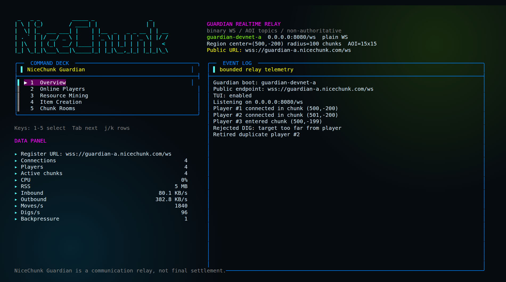

# NiceChunk Guardian

NiceChunk Guardian is a high-performance regional WebSocket relay for the NiceChunk on-chain voxel world.

Guardian is not an authoritative game server. It does not own player assets, sign player transactions, settle resources, or decide final block state. Player ownership and final settlement remain Solana contract responsibilities. Guardian only forwards nearby realtime events with low latency.

## Scope

- Accept player `HELLO` inside a configured Guardian service region.
- Relay `MOVE`, `DIG_EVENT`, `PLAYER_JOIN`, and `PLAYER_LEAVE` to nearby chunks only.
- Maintain temporary online connection state.
- Use compact binary WebSocket frames.
- Avoid JSON, Socket.IO, protobuf, msgpack, cbor, and permessage-deflate in the realtime protocol.

## Defaults

- Listen host: `0.0.0.0`
- Listen port: `8080`
- Public URL: `ws://127.0.0.1:8080/ws`
- WebSocket path: `/ws`
- TLS: disabled
- Service range: center chunk `(0, 0)`, radius `100`, total `201 x 201` chunks
- AOI broadcast: `15 x 15` chunks, radius `7`
- Compression: disabled

The server never assumes port `443`. Third-party Guardians can run on `8080`, `8443`, `18080`, or any available port. Clients must use the full `public_url` from Guardian registration.

## Build

Install Linux dependencies:

```bash
sudo apt-get update
sudo apt-get install -y build-essential cmake git libssl-dev zlib1g-dev python3 python3-pip
```

Build with C++20 and Release optimization:

```bash
cd Guardian
cmake -S . -B build -DCMAKE_BUILD_TYPE=Release
cmake --build build -j
ctest --test-dir build --output-on-failure
```

If uWebSockets is already checked out:

```bash
cmake -S . -B build -DCMAKE_BUILD_TYPE=Release -DUWS_SOURCE_DIR=/path/to/uWebSockets
```

## Run Local WS

```bash
./build/nicechunk-guardian --config config/guardian.example.conf
```

Interactive terminals show the built-in cyberpunk TUI by default. It uses bounded in-memory log history and refreshes at `tui_refresh_hz`, so it does not grow over time.



The TUI is an operator dashboard for the realtime relay. It shows the Guardian identity, listen endpoint, public endpoint, service-region center, service radius, AOI width, live player counters, traffic rates, backpressure count, selected section detail, and bounded event log. It is intentionally observational: it does not mint assets, sign transactions, settle resources, or decide final world state.

TUI controls:

- `1-5`: select Overview, Online Players, Resource Mining, Item Creation, Chunk Rooms
- `Tab`: next section
- `j/k` or arrow up/down: move the selected row in list views

Disable TUI for systemd, logs, or benchmarks:

```bash
./build/nicechunk-guardian --config config/guardian.example.conf --no-tui
```

Custom port:

```bash
./build/nicechunk-guardian \
  --port 18080 \
  --public-url ws://1.2.3.4:18080/ws
```

Custom region:

```bash
./build/nicechunk-guardian \
  --center-x 500 \
  --center-z -200 \
  --service-radius 100 \
  --aoi 15
```

## 443 / WSS

Official nodes may listen directly on 443:

```bash
sudo setcap 'cap_net_bind_service=+ep' ./build/nicechunk-guardian
./build/nicechunk-guardian \
  --port 443 \
  --public-url wss://guardian-a.nicechunk.com/ws \
  --tls \
  --cert /etc/letsencrypt/live/guardian-a.nicechunk.com/fullchain.pem \
  --key /etc/letsencrypt/live/guardian-a.nicechunk.com/privkey.pem
```

Recommended production setup is reverse proxy TLS on 443 and Guardian on local 8080. See [deploy/nginx.conf](deploy/nginx.conf) and [deploy/Caddyfile](deploy/Caddyfile).

### Node-Owned WSS

Guardian nodes should expose their own endpoint. NiceChunk clients must use the complete endpoint from node registration, such as:

```text
wss://guardian.node-owner.com/ws
wss://guardian.1.2.3.4.sslip.io/ws
wss://node-owner.example:8443/ws
```

A Guardian node does not need to depend on `nicechunk.com` for WebSocket traffic.

Use an existing certificate:

```bash
sudo scripts/setup_wss_node.sh \
  --domain guardian.node-owner.com \
  --cert /etc/ssl/guardian/fullchain.pem \
  --key /etc/ssl/guardian/privkey.pem
```

Automatically request a free Let's Encrypt certificate for your own domain:

```bash
sudo scripts/setup_wss_node.sh \
  --domain guardian.node-owner.com \
  --email ops@node-owner.com
```

For testing, automatically use an `sslip.io` name pointing at the node public IP:

```bash
sudo scripts/setup_wss_node.sh --auto-sslip
```

Then start Guardian behind the local reverse proxy:

```bash
./build/nicechunk-guardian \
  --host 127.0.0.1 \
  --port 8080 \
  --public-url wss://guardian.node-owner.com/ws \
  --no-tui
```

`sslip.io` risk: it is a third-party wildcard DNS service. It is useful for quick tests because `guardian.1.2.3.4.sslip.io` resolves to `1.2.3.4`, but production nodes should prefer their own domain. If `sslip.io` has downtime, changes policy, is blocked by a network, or has DNS issues, clients cannot resolve the node. It also gives the node no brand control and makes long-term registry/trust management weaker than a domain owned by the operator.

## Binary Protocol

Every WebSocket binary frame contains exactly one NiceChunk Guardian message. The first byte is `type`; WebSocket already carries payload length, so there is no extra message length field.

All numbers are little-endian. Struct memory is never sent directly.

Message types:

- `0x01` `HELLO`
- `0x02` `HELLO_ACK`
- `0x03` `ERROR`
- `0x04` `PING`
- `0x05` `PONG`
- `0x10` `MOVE`
- `0x11` `MOVE_BATCH`
- `0x20` `DIG`
- `0x21` `DIG_EVENT`
- `0x30` `PLAYER_JOIN`
- `0x31` `PLAYER_LEAVE`

High-frequency movement uses local chunk indexes, fixed-point positions, `uint16_t` local player IDs, and batched `MOVE_BATCH` frames. The default V1 service radius must be `<= 127` so a local chunk coordinate fits in `uint8_t`.

`PLAYER_JOIN` and `PLAYER_LEAVE` include a wallet-derived owner fingerprint so clients can remove stale avatars immediately when the same wallet reconnects. `MOVE_BATCH` intentionally stays compact and does not carry wallet identity.

## Broadcast Model

Guardian service range decides who may connect:

```text
chunk_x >= center_x - service_radius
chunk_x <= center_x + service_radius
chunk_z >= center_z - service_radius
chunk_z <= center_z + service_radius
```

AOI broadcast decides who receives events:

```text
15 x 15 chunks by default
radius = 7
```

Guardian never broadcasts player changes to the whole `201 x 201` service region.

## Test Client

Install Python dependency:

```bash
python3 -m pip install websockets
```

Run:

```bash
python3 scripts/local_client.py --url ws://127.0.0.1:8080/ws
```

## Bench

```bash
python3 scripts/bench_ws.py --url ws://127.0.0.1:8080/ws -n 1000 --move-hz 10 --seconds 30
python3 scripts/bench_ws.py --url ws://127.0.0.1:8080/ws -n 1000 --move-hz 10 --hotspot
```

The script prints connection count, disconnects, move throughput, and send latency percentiles.

## Linux Tuning

```bash
ulimit -n 1000000
sudo sysctl -w net.core.somaxconn=65535
sudo sysctl -w net.ipv4.ip_local_port_range="10000 65000"
sudo sysctl -w net.ipv4.tcp_tw_reuse=1
```

## Current Version

V0 is a single-process, single uWebSockets event loop design. It is intentionally lock-free in the hot path. Later versions can shard by Guardian region, process, port, or worker-owned chunk ranges.

The current V1 binary chunk-index mode supports `service_radius_chunks <= 127`; larger regions should use a future V2 wire format with `uint16_t` local chunk indexes.
