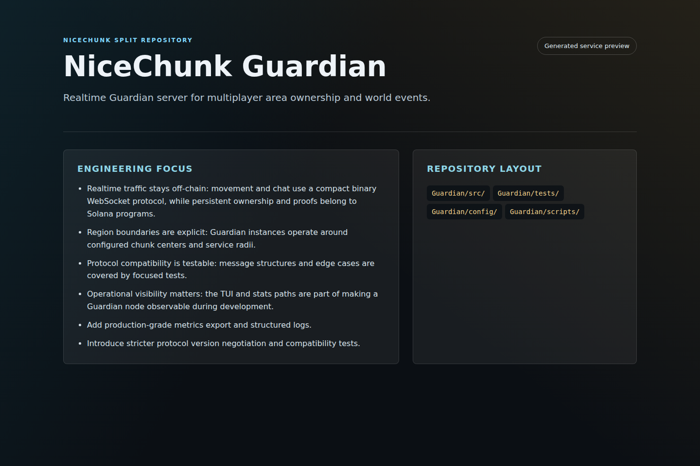
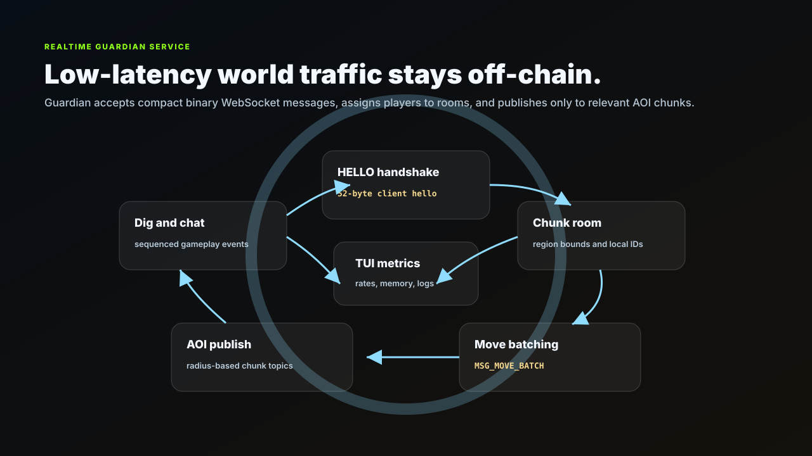
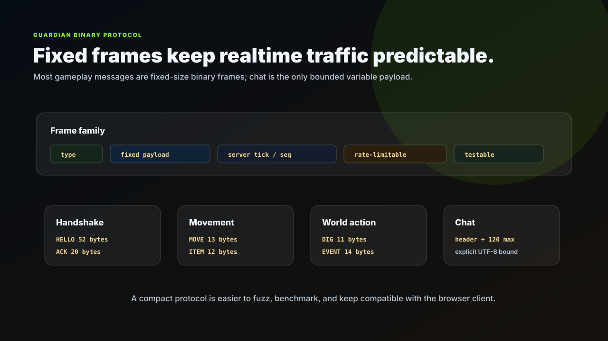
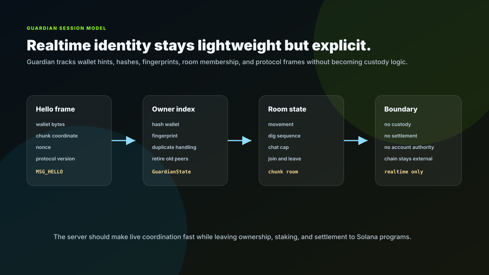
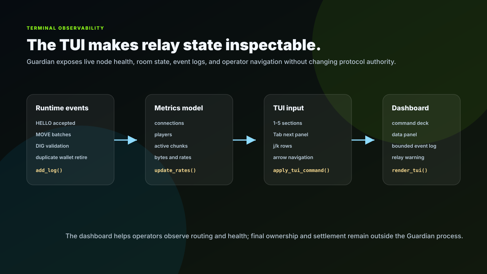

# NiceChunk Guardian

Realtime Guardian server for multiplayer area ownership and world events.

## Project Overview

This repository contains the C++ Guardian service. Guardian is the realtime server component that handles local player presence, movement messages, dig events, chat, AOI behavior, and service-region boundaries.

The service is intentionally separate from the browser client and the chain registry program. The chain program records ownership and registration; this server handles low-latency realtime traffic for the region it operates.

The C++ codebase is small enough for direct systems-level review while still supporting practical deployment concerns such as configuration files, protocol tests, and local client scripts.

## Realtime Loop

Guardian is the low-latency half of the world protocol. A client starts with a fixed-size `HELLO`, receives a local player ID and region bounds, then sends compact movement, dig, and chat messages. The service assigns players to chunk rooms and publishes updates only to the area of interest around each room.

The protocol is intentionally small: fixed message tags, explicit payload sizes, bounded chat bytes, dig sequence checks, and move batching. That shape keeps realtime traffic cheap to process and easy to test. Persistent ownership, staking, and proof submission remain outside this server and belong to the Solana program layer.

## Binary Protocol Frame

Guardian's wire format is designed for predictability. Handshake, movement, dig, join, leave, ping, and pong messages use fixed-size frames. Chat is variable-length, but it is capped and has an explicit header. That makes rate limits, fuzz tests, and compatibility checks much simpler than a free-form JSON stream.

The service should preserve that property as features grow. New realtime features should justify their byte shape, payload limit, rate-limit behavior, and browser client compatibility before they become part of the protocol.

## Session Ownership Flow

Guardian identity is intentionally lightweight. The server receives wallet bytes in the hello frame, derives indexes that help manage duplicate sessions, and keeps room membership tied to chunk coordinates. That is enough for realtime coordination without pretending the WebSocket server owns player assets.

As the protocol expands, new message types should be evaluated against this boundary: can the server process the frame cheaply, rate-limit it, and recover from disconnects without becoming a hidden settlement layer?

## TUI Dashboard

Guardian ships with a terminal user interface rather than a graphical desktop GUI. The TUI is enabled automatically when the process runs in an interactive terminal and `enable_tui` is true. It is disabled for non-interactive service environments with `--no-tui`, where the process falls back to periodic stats logging.

The dashboard is organized around operational questions. The header shows node identity, listen address, transport mode, service-region center, service radius, AOI width, and public endpoint. The left command deck exposes five sections: Overview, Online Players, Resource Mining, Item Creation, and Chunk Rooms. The data panel shows live counters and selected-section detail. The right event log is bounded by `tui_log_capacity`, so the dashboard remains useful during long-running sessions without unbounded memory growth.

The important design point is authority separation. The TUI can show connected players, active rooms, move and dig rates, duplicate-wallet retirement, rejected protocol actions, and backpressure signals. It does not make Guardian an authoritative game server. It is an operator visibility layer for a realtime relay whose final ownership, resource settlement, and asset state remain outside the process.

## TUI Observability Loop

The TUI is driven by the same runtime state used by the relay. WebSocket events update `Metrics`, room membership, player maps, and bounded log entries. The ticker refreshes the dashboard at `tui_refresh_hz`, drains keyboard commands, applies section or row navigation, and renders the screen through `GuardianState::render_tui()`.

That makes the TUI a low-risk operational surface. It reads and presents relay state, but it does not participate in protocol validation, signing, registry updates, or settlement. Operators can use it to verify that the node is accepting players, publishing AOI-scoped traffic, rejecting invalid DIG requests, and staying within backpressure limits.

## System Principles

- Realtime traffic stays off-chain: movement and chat use a compact binary WebSocket protocol, while persistent ownership and proofs belong to Solana programs.
- Region boundaries are explicit: Guardian instances operate around configured chunk centers and service radii.
- Protocol compatibility is testable: message structures and edge cases are covered by focused tests.
- Operational visibility matters: the TUI and stats paths are part of making a Guardian node observable during development.

## How It Works

- Build the service with CMake, run protocol tests, and launch with a Guardian configuration file.
- Use local scripts to simulate clients and benchmark WebSocket traffic.
- Pair service configuration with on-chain Guardian registry entries so clients can discover the correct region endpoint.
- Keep binary protocol changes synchronized with the browser Guardian client.

## Why This Project Matters

NiceChunk needs a realtime layer that can move faster than chain confirmation while remaining anchored to public ownership rules. Guardian provides that layer.

A standalone service repository makes it possible for operators to fork, inspect, and run Guardian nodes without pulling frontend or contract documentation assets.

## Repository Layout

- `Guardian/src/`
- `Guardian/tests/`
- `Guardian/config/`
- `Guardian/scripts/`

## Development Workflow

1. Clone the repository and inspect the focused source tree before changing shared contracts or generated artifacts.
2. Keep changes scoped to the domain of this repository. Cross-domain changes should be coordinated through the matching split repositories.
3. Run the smallest meaningful validation for the touched surface: build checks for programs, browser checks for pages, or fixture checks for deterministic libraries.
4. Update screenshots and documentation when behavior, visible UI, public constants, or developer-facing workflows change.

## Future Development Direction

- Add production-grade metrics export and structured logs.
- Introduce stricter protocol version negotiation and compatibility tests.
- Integrate automated proof submission against the Guardian registry program.
- Document deployment topologies without committing environment-specific deployment scripts.

## Maintenance Notes

This repository is a focused split from the main NiceChunk working tree. Keep the public surface explicit: avoid committing private keys, wallet files, deployment-only scripts, machine-specific configuration, or generated build artifacts. Runtime user-facing copy should stay behind the i18n layer where the project has an i18n surface.
